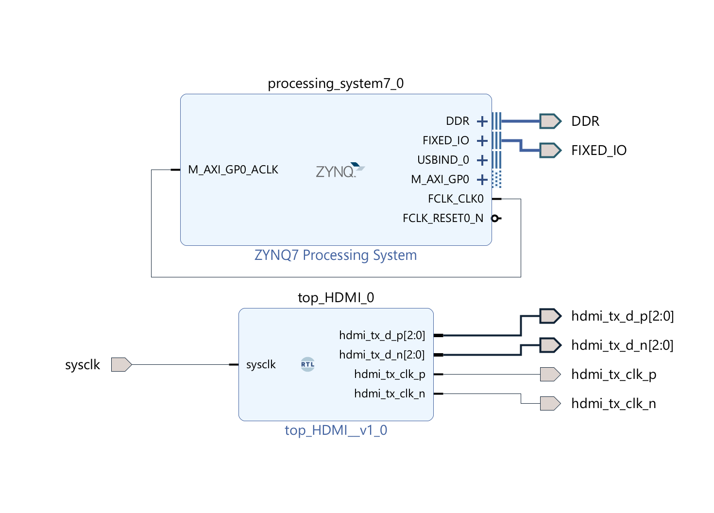
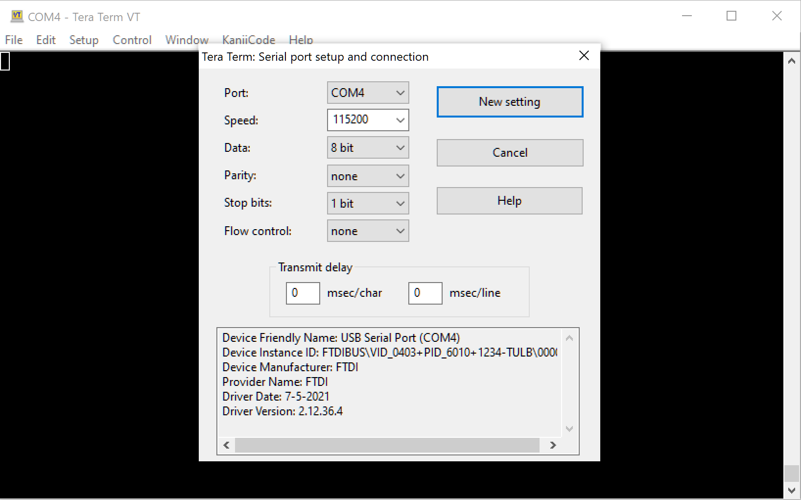

# Project Documentation

## Prerequisites

- Xilinx toolsuite
- PYNQ-Z2 board (or ZYNQ XC7Z020 compatible)

## Manifest

```code
$project/
build
clean
create
|-firmware/
  |-src/*.c
  |-vitis/ (generated, not checked-in)
    |-pynq_z2_pfm/
    |-$project_app/
    |-$project_system/
|-hardware/
  |-constraints/*.xdc
  |-ip/*.xci (optional)
  |-pynq-z2-board/ (optional)
  |-vivado-library (optional)
  |-src/*.v
  |-vivado/ (generated, not checked-in)
    |-$project.xpr
    |-design_1_wrapper.xsa
```

## Getting Started

### Checkout the project

```sh
> git clone ...
```

### Post checkout - Generate the fpga and firmware project files

- Windows: open a command prompt in the project root

  ```cmd
  >create.bat
  ```

- Windows Git Bash: open a shell prompt in the project root

- Linux: not yet tested

```sh
  > ./create
```

**Note:** The above script

1. Creates a Vivado project
2. Generates hardware specifications for the FPGA and exports an xsa file
3. Generates a Vitis workspace

(This process will take a few minutes to complete)

### FPGA - post-generation fixes

None required

### Firmware - post-generation fixes

Fix the Boot Image in the system project

- Open a Vitis workspace in ./firmware
- In Explorer, right click $NAME_app_system-> Create Boot Image
- We need 3 boot image partitions
  - (bootloader): ./firmware/\$BOARD_pfm/export/\$BOARD_pfm/sw/\$BOARD_pfm/boot/fsb.elf
  - bitstream: ./fpga/fpga.runs/impl_1/\*.bit <-- **Important!** Use the fpga project bitstream to ensure changes stay in synch
  - \$APP.elf: ./firmware/\$APP_app/Debug/\$APP_app.elf
- -> Create Image

## Notes

The Firmware project supports creating a BOOT.bin image to run standalone off of an SD card

The TUL PYNQ-Z2 board file is included to make this project as self-contained as possible

<https://dpoauwgwqsy2x.cloudfront.net/Download/pynq-z2.zip>

## FPGA Project

### FPGA Project - Design



### FPGA Project - Summary

## Firmware Project

## Firmware Project - C Application

### Firmware Project - Connect a Serial Terminal

- Window->Show View->Vitis->Vitis Serial Terminal
- Select '+' button in terminal and configure COM port
- Serial port config
  - 115200
  - 8 bit
  - no parity
  - 1 stop bit
  - no flow control
- or use Tera Term



## References

<https://www.fpga4fun.com/HDMI.html>
<https://www.youtube.com/watch?v=sMOZxOCfkBU>
